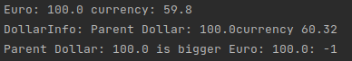
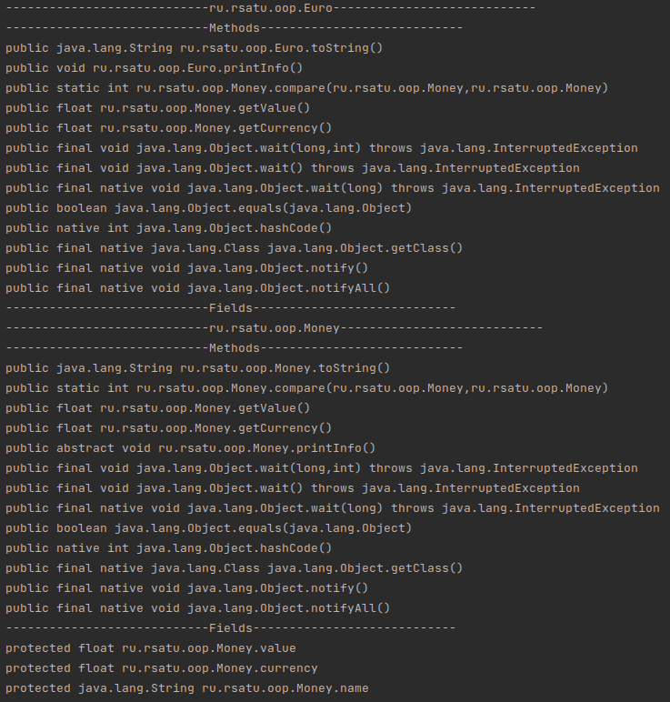
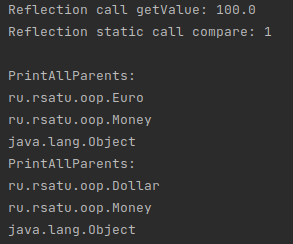
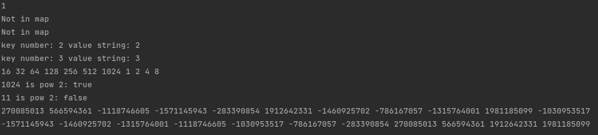
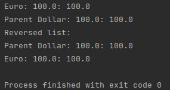

= Отчет по лабораторной работе 3
:listing-caption: Листинг
:figure-caption: Рис
:source-highlighter: coderay

Студент: Беляев Максим

Группа: ПИМ-22

== 1. Постановка задачи

В процессе выполнения лабораторной работы необходимо выполнить следующие задачи:

. ООП.
.. Создать интегрфейс
.. Создать абстрактный класс
.. Создать класс, имплементирующий интерфейс
.. Создать класс-наследник абстрактного класса

. Reflection
.. Выгрузить все поля и методы класса с помощью рефлексии
.. Вызвать несколько методов класса
.. Вывести на экран всех предков класса

. Collections
.. Ознакомится со всеми коллекциями java (list, set, map) и их реализацией
.. Продемонстрировать в программе работу с каждым видом реализации коллекции (list, set, map)

. Generics
.. Сделать дженерик на класс
.. Сделать дженерик на метод

== 2. Разработка задачи

=== 2.1 Структура проекта

Проект разделен на следующие директории:

docs::
Данная документация

src::
Исходный код лабораторной работы

src/main/java/ru/rsatu/oop:::
Задание 1

src/main/java/ru/rsatu/reflect::
Задание 2

src/main/java/ru/rsatu/collections::
Задание 3

src/main/java/ru/rsatu/generics::
Задание 4

== 3. Информация о реализации

=== 3.1 Задание 1

Для выполнения первого задания был создан интерфейс MoneyInteface.

.MoneyInteface
[source,java]
----
package ru.rsatu.oop;

public interface MoneyInterface {
    String toString();
    float getValue();
    float getCurrency();
}
----

Затем был создан абстрактный класс Money, имплементирующий интерфейс MoneyInteface и, содержащий абстрактный метод printInfo

.Код класса Money
[source,java]
----
public abstract class Money implements MoneyInterface {
    protected float value;
    protected float currency;
    protected String name;
    public Money(String name, float value, float currency) {
        this.value = value;
        this.currency = currency;
        this.name = name;
    }

    public static int compare(Money obj1, Money obj2) {
        return Float.compare(obj1.getCurrency()*obj1.getValue(),obj2.getCurrency()*obj2.getValue());
    }

    @Override
    public float getValue() {
        return value;
    }

    @Override
    public float getCurrency() {
        return currency;
    }

    @Override
    public String toString() {
        return "Parent "+name+": "+getValue();
    }
    public abstract void printInfo();
}
----

Для класса Money было создано два класса-потомка: Euro и Dollar

.Euro
[source,java]
----
package ru.rsatu.oop;

public class Euro extends Money{

    public Euro(float value) {
        super(Euro.class.getName(), value, 59.8f);
    }

    @Override
    public String toString() {
        return "Euro: "+getValue();
    }

    @Override
    public void printInfo() {
        System.out.println(this+ " currency: "+getCurrency());
    }
}
----

.Dollar
[source,java]
----
package ru.rsatu.oop;

public class Dollar extends Money{
    public Dollar(float value) {
        super("Dollar", value, 60.32f);
    }

    @Override
    public void printInfo() {
        System.out.println("DollarInfo: "+this+ "currency "+getCurrency());
    }
}
----

В исполняемый класс Main был добавлен и запущен пример использования.

.Пример в классе Main
[source,java]
----
Money m1 = new Euro(100);
Money m2 = new Dollar(100);
m1.printInfo();
m2.printInfo();
System.out.println(m2+" is bigger "+m1+": "+Money.compare(m1,m2));
----

.Результат работы скомпилированного файла
----
Euro: 100.0 currency: 59.8
DollarInfo: Parent Dollar: 100.0currency 60.32
Euro: 100.0 is bigger Parent Dollar: 100.0: -1
----

=== 3.2 Задание 2

Для выполнени задания 2, был создан создан класс Dump

.Класс Dump
[source,java]
----
public class Dump {
    public static void dumpEverything(String className) {
        try {
            Class<?> c = Class.forName(className);
            System.out.println("----------------------------"+className+"----------------------------");
            Method[] m = c.getMethods();
            System.out.println("----------------------------Methods----------------------------");
            for (Method method : m)
                System.out.println(method.toString());
            Field[] f = c.getDeclaredFields();
            System.out.println("----------------------------Fields----------------------------");
            for (Field field : f)
                System.out.println(field.toString());

        }
        catch (Throwable e) {
            System.err.println(e);
        }
    }

    public static Method getSomeMethod(Class<?> cls, String methodName, Class... parameterTypes) {
        try {
            return cls.getMethod(methodName, parameterTypes);
        } catch (SecurityException | NoSuchMethodException e) {
            return null;
        }
    }

    public static void printAllParents(Class<?> cls) {
        System.out.println("PrintAllParents:");
        while (cls != null) {
            System.out.println(cls.getName());
            cls = cls.getSuperclass();
        }
    }
}
----

Метод `dumpEverything` выводит на экран список всех методов и полей класса указанным названием

Для демонстрации его работы в класс `Main` был добавлен следующий код

.Пример в классе Main
[source, java]
----
Dump.dumpEverything(m1.getClass().getName());
Dump.dumpEverything(m1.getClass().getSuperclass().getName());
----

.Результат работы примера
[source, java]
----
----------------------------ru.rsatu.oop.Euro----------------------------
----------------------------Methods----------------------------
public java.lang.String ru.rsatu.oop.Euro.toString()
public void ru.rsatu.oop.Euro.printInfo()
public float ru.rsatu.oop.Money.getValue()
public static int ru.rsatu.oop.Money.compare(ru.rsatu.oop.Money,ru.rsatu.oop.Money)
public float ru.rsatu.oop.Money.getCurrency()
public final native void java.lang.Object.wait(long) throws java.lang.InterruptedException
public final void java.lang.Object.wait(long,int) throws java.lang.InterruptedException
public final void java.lang.Object.wait() throws java.lang.InterruptedException
public boolean java.lang.Object.equals(java.lang.Object)
public native int java.lang.Object.hashCode()
public final native java.lang.Class java.lang.Object.getClass()
public final native void java.lang.Object.notify()
public final native void java.lang.Object.notifyAll()
----------------------------Fields----------------------------
----------------------------ru.rsatu.oop.Money----------------------------
----------------------------Methods----------------------------
public java.lang.String ru.rsatu.oop.Money.toString()
public float ru.rsatu.oop.Money.getValue()
public static int ru.rsatu.oop.Money.compare(ru.rsatu.oop.Money,ru.rsatu.oop.Money)
public float ru.rsatu.oop.Money.getCurrency()
public abstract void ru.rsatu.oop.Money.printInfo()
public final native void java.lang.Object.wait(long) throws java.lang.InterruptedException
public final void java.lang.Object.wait(long,int) throws java.lang.InterruptedException
public final void java.lang.Object.wait() throws java.lang.InterruptedException
public boolean java.lang.Object.equals(java.lang.Object)
public native int java.lang.Object.hashCode()
public final native java.lang.Class java.lang.Object.getClass()
public final native void java.lang.Object.notify()
public final native void java.lang.Object.notifyAll()
----------------------------Fields----------------------------
protected float ru.rsatu.oop.Money.value
protected float ru.rsatu.oop.Money.currency
protected java.lang.String ru.rsatu.oop.Money.name
----

Метод `getSomeMethod` позволяет получить метод класса по указанному имени

Для демонстрации его работы в класс `Main` был добавлен следующий код

.Пример в классе Main
[source,java]
----
Method meth = Dump.getSomeMethod(m1.getClass(), "getValue");
try {
    System.out.println("\n\nReflection call getValue: " + meth.invoke(m1));
} catch (InvocationTargetException | IllegalAccessException e) {
    e.printStackTrace();
}

meth = Dump.getSomeMethod(Money.class, "compare", Money.class, Money.class);
try {
    System.out.println("Reflection static call compare: " + meth.invoke(null,m2,m1)+'\n');
} catch (InvocationTargetException | IllegalAccessException e) {
    e.printStackTrace();
}
----

.Результат выполнения примера
[source]
----

Reflection call getValue: 100.0
Reflection static call compare: 1

----

Метод `printAllParents` выводит всех предков указанного класса

Для демонстрации его работы в класс `Main` был добавлен следующий код

.Пример в классе Main
[source,java]
----
Dump.printAllParents(m1.getClass());
Dump.printAllParents(m2.getClass());
----

.Результат выполнения примера
[source]
----
PrintAllParents:
ru.rsatu.oop.Euro
ru.rsatu.oop.Money
java.lang.Object
PrintAllParents:
ru.rsatu.oop.Dollar
ru.rsatu.oop.Money
java.lang.Object
----

=== 3.3 Задание 3

Для выполнения задания 3 был создан класс Collections

.Класс Collections
[source,java]
----
package ru.rsatu.collections;

import java.util.ArrayList;
import java.util.HashMap;
import java.util.HashSet;
import java.util.List;
import java.util.Map;
import java.util.Random;
import java.util.Set;

public class Collections {

    private static Map<Integer, String> intMap = new HashMap<>();
    private static Set<Integer> pow2Set = new HashSet<>();
    private static List<Integer> numbersList = new ArrayList<>();

    private static String intToStr(Integer number) {
        if (intMap.containsKey(number)) {
            return intMap.get(number);
        } else {
            return "Not in map";
        }
    }

    private static boolean isPow2(Integer number) {
        return pow2Set.contains(number);
    }

    public static void demo() {
        intMap.put(1,"1");
        intMap.put(2, "2");
        intMap.put(3,"3");
        System.out.println(intToStr(1));
        System.out.println(intToStr(10));
        intMap.remove(1);
        System.out.println(intToStr(1));
        intMap.forEach((number, s) -> System.out.println("key number: " + number + " value string: " + s ));

        for (int i = 1; i <= 1024; i = i*2) {
            pow2Set.add(i);
        }
        pow2Set.forEach((number -> System.out.print(number + " ")));
        System.out.println();
        System.out.println("1024 is pow 2: "+isPow2(1024));
        System.out.println("11 is pow 2: "+isPow2(11));

        Random rnd = new Random();
        for (int i = 0; i <= 10; i++) {
            numbersList.add(rnd.nextInt());
            System.out.print(numbersList.get(i) + " ");
        }
        System.out.println();
        java.util.Collections.sort(numbersList);
        numbersList.forEach((n) -> System.out.print(n + " "));
        System.out.println();
    }
}
----

Затем вызов Метода `demo` был добавлен в класс Main

.Вызов метода demo в Main
[source,java]
----
Collections.demo();
----

.Результат выполнения
[source]
----
1
Not in map
Not in map
key number: 2 value string: 2
key number: 3 value string: 3
16 32 64 128 256 512 1024 1 2 4 8
1024 is pow 2: true
11 is pow 2: false
-1449713170 1596164888 -1114965466 1597502841 987232442 -482022199 672539988 -876334109 -1113571842 -753706178 903805304
-1449713170 -1114965466 -1113571842 -876334109 -753706178 -482022199 672539988 903805304 987232442 1596164888 1597502841
----
== 3.4 Задание 4

Для выполнения задания 4 созданим Generic-класс Pair

.Класс Pair
[source, java]
----
package ru.rsatu.generics;

public class Pair<F, S> {

    private final F first;
    private final S second;

    public Pair(F first, S second) {
        this.first = first;
        this.second = second;
    }

    public F getFirst()    {
        return first;
    }
    public S getSecond() {
        return second;
    }
}
----

Так же создадим класс Reverse с generic-методом reverseGeneric, который будет возвращать список в обратном порядке.

.Класс Reverse
[source, java]
----
package ru.rsatu.generics;

import java.util.Collections;
import java.util.List;

public class Reverse {
    public static <T> List<T> reverseGeneric(List<T> list) {
        List<T> copyList = list.subList(0, list.size());
        Collections.reverse(copyList);
        return copyList;
    }
}
----

Для демонстрации их работы добавим следующий код в класс Main

.Изменения в классе Main
[source, java]
----
List<Pair<String, Money>> money = Arrays.asList(
        new Pair<>(m1.toString(), m1),
        new Pair<>(m2.toString(), m2)
);

for (Pair<String, Money> m : money) {
    System.out.println(m.getFirst() + ": " + m.getSecond().getValue());
}

List<Pair<String, Money>> reversed = Reverse.reverseGeneric(money);
System.out.println("Reversed list:");

reversed.forEach((m) -> System.out.println(m.getFirst() + ": " + m.getSecond().getValue()));
----

.Результат работы
[source]
----
Euro: 100.0: 100.0
Parent Dollar: 100.0: 100.0
Reversed list:
Parent Dollar: 100.0: 100.0
Euro: 100.0: 100.0
----

== 4. Результаты выполнения

В результате выполнения лабораторной работы были создан интерфейс `MoneyInterface`, классы `Money`, `Dollar`, `Euro`, `Dump`, `Collections`, `Pair`, `Reverse`, `Main`.

В классе `Main` содержится демонстрация работы всех остальных классов:

.Результат выполнения первого задания

.Результат выполнения второго задания

.Результат выполнения второго задания

.Результат выполнения третьего задания

.Результат выполнения четвертого задания

== 5. Вывод

В результате выполнения лабораторной работы получены навыки по работе с ООП (создание интерфейсов, абстрактных классов, классов-наследников, классов имплементирующих интерфейс), использованию Reflection (получение полей и методов класса, вызов методов, просмотр предков класса), взаимодействию со стандартными коллекциями (list, set, map), созданию generic-классов и методов.
